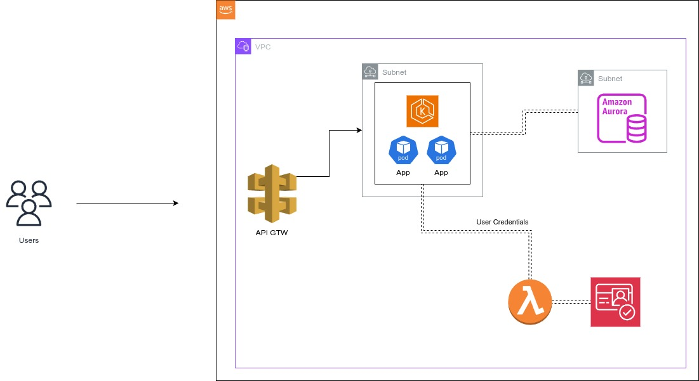

# Contexto e Problema </img>
Esta aplicação Lambda foi desenvolvida para suportar o gerenciamento de identidade de acesso (CIAM) do projeto [Tech Challenge](https://github.com/6SOATGP54/tech-challenge).

# Desenho
A aplicação utiliza o serviço Amazon Cognito, conforme diagrama abaixo, para fazer o gerenciamento de acessos.

    Diagrama da Arquitetura do Projeto na AWS</img>

# Detalhes
A aplicação foi desenvolvida em Java utilizando práticas de Arquitetura Limpa e Código Limpo, separando as camadas do código de acordo com as suas respectivas responsabilidades. O deploy para a AWS é acionado via _actions_ pelo próprio Github.
